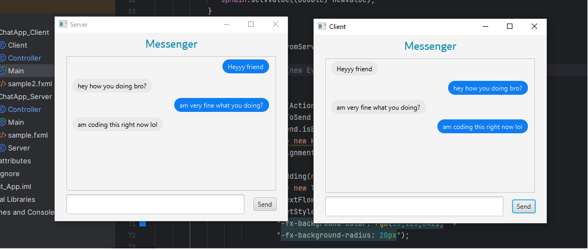

# JavaFX Chat Messenger Application 💬

A simple **chat application** built with **JavaFX** for GUI and **Java Sockets** for client-server communication. This project allows real-time messaging between a server and one or multiple clients.  

---

## Features

- Real-time chat between server and client.  
- User-friendly GUI built with JavaFX.  

---

## How to Run

### 1. Run the Server (FIRST RUN THIS)
1. Open the `Server` project in your IDE (e.g., IntelliJ).  
2. Run the `ServerController` class.  
3. The server will start listening on **port 1234**.  

### 2. Run the Client
1. Open the `Client` project in your IDE.  
2. Run the `ClientController` class.  
3. Update the client IP if your server is on another machine:  
```java
client = new Client(new Socket("SERVER_IP_HERE", 1234));
```
### ScreenShot




## JavaFX Library Note

- The **JavaFX library files are included** in this repository.  
- If you import the project, **just update the project structure** to point to the `lib` folder containing JavaFX and add the VM.  
- No need to download JavaFX separately.  

